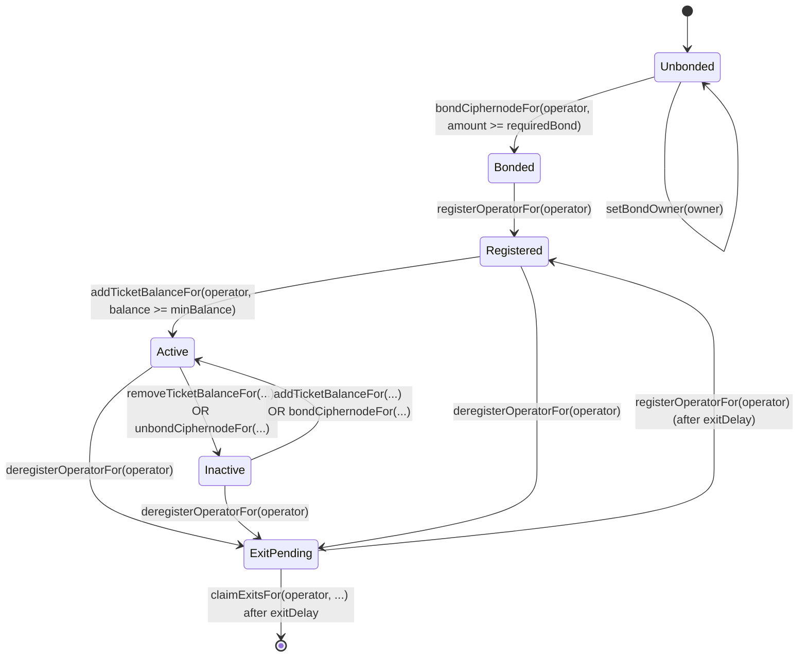

import { Callout } from 'nextra/components'

# Ciphernode Operators

<Callout type='info'>
  **Bracken is live on Robinhood Chain** (chain id `4663`). Any address shown inline below is an
  example unless it appears on [Deployments](/deployments) — that page is generated from the
  deployment record and is the one to configure against.
</Callout>

Ciphernodes are the distributed workers that power the Bracken network. They participate in
threshold cryptography to enable encrypted execution environments (E3s) while ensuring no single
party can access the underlying plaintext data.

> **Interactive setup:** the dashboard has a step-by-step operator guide. It reads the live bonding
> registry and sends each on-chain step from your wallet. Open
> [Run a ciphernode](https://bracken-dashboard-solplay.vercel.app/#operator).

## What is a Ciphernode?

A ciphernode is a node operator that:

- **Generates key shares**: Creates PVSS (Publicly Verifiable Secret Sharing) key shares for each
  committee
- **Publishes public keys**: Contributes to aggregated committee public keys used for encryption
- **Produces decryption shares**: Decrypts computation outputs when the threshold is met
- **Maintains availability**: Stays online and responsive to participate in sortition and committee
  duties

Ciphernodes earn rewards for successful participation and risk slashing for missed duties or
malicious behavior.

## Contract Architecture

Bracken protocol uses several contracts that work together:

| Contract               | Purpose                                                             |
| ---------------------- | ------------------------------------------------------------------- |
| **Bracken**            | Core coordinator that manages E3 requests and computation lifecycle |
| **CiphernodeRegistry** | Tracks registered operators and manages committee formation         |
| **BondingRegistry**    | Handles ciphernode bonds (BRACKEN) and ticket balances (tBRACKEN)   |
| **SlashingManager**    | Processes slashing proposals, appeals, and ban enforcement          |
| **E3RefundManager**    | Calculates and distributes refunds when an E3 fails                 |
| **BrackenToken**       | BRACKEN token used for ciphernode bonding                           |
| **BrackenTicketToken** | Non-transferable tBRACKEN token representing ticket balances        |

### Contract addresses

Bracken runs on **Robinhood Chain**, chain id `4663`. These are the addresses an operator needs; the
full set is on [Deployments](/deployments).

| Contract             | Address                                      |
| -------------------- | -------------------------------------------- |
| Bracken              | `0xB2719FBF71F723FAb7fEAa1f3D2B6F23530AeE12` |
| CiphernodeRegistry   | `0x7d6e460B1704B5B1cd5570E62a3c450a9611C346` |
| BondingRegistry      | `0x54921442e3f4272A899D6b647efB18f761a12CF6` |
| SlashingManager      | `0xd6f9AeEF1d419c5F2722157b73e2a4faBCd80d42` |
| E3RefundManager      | `0xa79BfE33F1cB1925F55ECCDBf50c7B0175BD9cF5` |
| BrackenTicketToken   | `0x03427Eb710120028f2C713d4e2De5E0AC07AC2B6` |
| BRACKEN (bond token) | `0x12BE21fafF941622806b770a3a6c0aAEc23cff20` |
| USDG (fee token)     | `0x5fc5360D0400a0Fd4f2af552ADD042D716F1d168` |

The bonding registry reads the bond token, ticket wrapper and ticket underlying back from itself at
runtime, so `BondingRegistry` is the only address the operator guide needs hardcoded.

E3 requests are currently **enabled** — `requestsPaused()` returns false. Ciphernodes can bond,
register and add ticket collateral at any time, paused or not.

### Proof verification

Two of the three proof slots are filled with real verifiers:

| Slot       | Contract                                     | State                                  |
| ---------- | -------------------------------------------- | -------------------------------------- |
| Decryption | `0xCAC5284b33303e1218C1E58311E5b896a17B2c4C` | real, delegates to the Honk aggregator |
| Public key | `0xf262E07deb78CfCd743B13cE249Ffff4B9394c59` | real, delegates to the Honk aggregator |
| Ciphertext | —                                            | **empty**                              |

The ciphertext slot is empty because the verifier for it is RISC Zero based and no RISC Zero
verifier exists on this chain. Nothing checks that submitted inputs are well-formed rather than junk
that could corrupt a computation. The verifier audit in the dashboard reads all three slots directly
off the chain and will tell you the same thing.

The registered E3 program is `MockE3Program` (`0x3E507b20FD0563bc5953A72625D975921a6278C4`), which
applies no application-specific rules. It is what makes the pipeline run; it is not what makes a
result trustworthy.

### BondingRegistry Operator Functions

The CLI and the dashboard both call these functions. Use this table when you integrate directly
against `BondingRegistry`.

| Function                                                | Caller                 | Purpose                                                  |
| ------------------------------------------------------- | ---------------------- | -------------------------------------------------------- |
| `setBondOwner(bondOwner)`                               | Operator key           | Authorize the wallet that controls this position         |
| `proposeBondOwner(operator, newOwner)`                  | Bond owner             | Nominate a replacement owner                             |
| `acceptBondOwner(operator)`                             | Nominated owner        | Accept the position and move the BRACKEN accounting      |
| `bondCiphernodeFor(operator, amount)`                   | Bond owner             | Bond BRACKEN from the caller's wallet                    |
| `unbondCiphernodeFor(operator, amount)`                 | Bond owner             | Queue bonded BRACKEN for exit                            |
| `registerOperatorFor(operator)`                         | Bond owner             | Add the operator key to the ciphernode registry          |
| `deregisterOperatorFor(operator)`                       | Bond owner or operator | Request deregistration and queue all collateral          |
| `addTicketBalanceFor(operator, amount)`                 | Bond owner             | Deposit the fee token and mint tickets                   |
| `removeTicketBalanceFor(operator, amount)`              | Bond owner             | Burn tickets and queue the underlying for exit           |
| `claimExitsFor(operator, maxTicket, 0)`                 | Anyone                 | Settle matured tickets to the bond owner                 |
| `claimExitsFor(operator, maxTicket, maxCiphernodeBond)` | Bond owner             | Claim matured tickets and ciphernode bond collateral     |
| `refreshOperatorStatus(operator)`                       | Anyone                 | Recompute one operator's status under the current policy |
| `refreshOperatorStatuses(operators)`                    | Anyone                 | Recompute a batch of operators                           |

Read the current state with these view functions:

| View                           | Returns                                                            |
| ------------------------------ | ------------------------------------------------------------------ |
| `bondOwnerOf(operator)`        | Wallet that controls the collateral, or the zero address if unset  |
| `pendingBondOwnerOf(operator)` | Wallet nominated to accept the position                            |
| `getCiphernodeBond(operator)`  | Active ciphernode bond                                             |
| `isCiphernodeBonded(operator)` | Whether the bond meets the active-maintenance floor (see below)    |
| `isRegistered(operator)`       | Whether the key is in the registry                                 |
| `isActive(operator)`           | Whether the operator is eligible for sortition                     |
| `availableTickets(operator)`   | `floor(ticketBalance / ticketPrice)`                               |
| `totalBonded(account)`         | BRACKEN that counts toward the locked-floor collateral of an owner |
| `hasExitInProgress(operator)`  | Whether an exit is queued                                          |

> `isCiphernodeBonded` and registration use different thresholds. `isCiphernodeBonded` tests the
> active-maintenance floor, which is `requiredCiphernodeBond` multiplied by
> `ciphernodeBondActiveBps` (80% by default). `registerOperatorFor` requires the full
> `requiredCiphernodeBond`. An operator between the two reads as bonded but cannot register: the
> call reverts with `NotCiphernodeBonded()`. Compare `getCiphernodeBond` against
> `requiredCiphernodeBond` to test whether an operator can register.

> `refreshOperatorStatus` is permissionless, but the operator must be registered. The call reverts
> with `NotRegistered()` for an operator that is not in the registry. `refreshOperatorStatuses`
> reverts if any operator in the list is not registered. Governance changes to the ticket price, the
> required bond, or the minimum ticket balance invalidate cached status. Call this function to
> restore the correct status for an operator.

## Operator Lifecycle

A ciphernode moves through several states during its lifecycle:

### State Descriptions

| State           | Description                                                                        |
| --------------- | ---------------------------------------------------------------------------------- |
| **Unbonded**    | No ciphernode bond deposited; cannot register                                      |
| **Bonded**      | BRACKEN bonded but not yet registered in the registry                              |
| **Registered**  | In the registry but lacking minimum ticket balance                                 |
| **Active**      | Fully operational; eligible for committee selection via sortition                  |
| **Inactive**    | Registered but below minimum requirements (tickets or ciphernode bond)             |
| **ExitPending** | Deregistration requested; waiting for exit delay before claiming or re-registering |

## Requirements

Before operating a ciphernode, ensure you have:

| Requirement           | Details                                                                                    |
| --------------------- | ------------------------------------------------------------------------------------------ |
| **BRACKEN Tokens**    | Mainnet requires at least `32,000 BRACKEN` for the ciphernode bond                         |
| **Ticket collateral** | Mainnet requires at least `1,000 sUSDS` shares for one ticket                              |
| **ETH**               | Gas for transactions on your target network                                                |
| **Hardware**          | Linux/macOS, 8+ cores, 32GB+ DDR5 RAM, 500GB+ NVMe SSD, stable internet with open UDP port |
| **Software**          | Bracken CLI installed, WebSocket RPC endpoint                                              |

## Getting Started

Follow these guides in order to become an active ciphernode operator:

1. **[Running a Ciphernode](./running)** - Set up your node using DappNode, Bracken CLI, or Docker
2. **[Registration & Bonding](./registration)** - Bond your ciphernode bond, register, and add
   tickets
3. **[Tickets & Sortition](./tickets-and-sortition)** - Understand how committee selection works
4. **[Exits, Rewards & Slashing](./exits-and-slashing)** - Learn about rewards and exit procedures

To do the on-chain steps in a browser instead of the CLI, use the
[interactive operator guide](https://bracken-dashboard-solplay.vercel.app/#operator) on the
dashboard.
