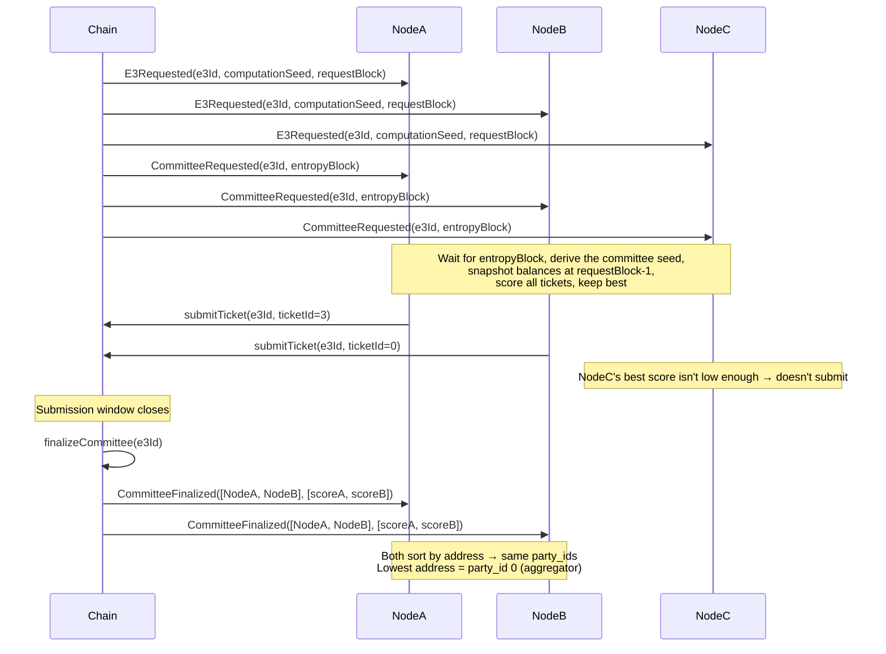

# Sortition

Sortition is the mechanism that selects a subset of registered ciphernodes to form a committee for
each E3 request. The design goals are:

- **Unpredictability** — the requester cannot know the outcome before its request is committed
- **Proportionality** — selection probability scales linearly with ticket stake
- **Determinism** — every honest node independently computes the same result
- **Sybil-resistance** — splitting funds across many wallets provides no advantage
- **On-chain verifiability** — the contract enforces the same rules the nodes compute off-chain

---

## Sortition Seed

Each request commits the next execution block as its entropy block. After that block is sealed, the
sortition seed combines its hash with the E3 identifier:

```solidity
seed = uint256(keccak256(abi.encode(blockhash(entropyBlock), e3Id)));
```

The paid request is final before this hash exists, so a requester cannot inspect the committee seed
and revert an unfavorable request in the same transaction. Rust reads the entropy block through the
execution RPC. By default, it waits for one block to build on top of the entropy block; operators
can configure a different confirmation count for their chain. The first ticket submission derives
and stores the same seed on-chain. No separate randomness transaction is required.

The E3 computation seed in `E3Requested` remains separate. It is still used by the cryptographic
workflow, but it does not rank tickets. A block producer can influence block-hash entropy, so this
design removes requester-side conditional-revert grinding without claiming the stronger guarantees
of verifiable randomness. Operators must submit while the committed hash remains available to the
contract. The contract uses EIP-2935 history when the chain provides it and otherwise relies on the
EVM's 256-block recent history.

---

## Ticket Balances and Eligibility

Each operator's weight in the lottery is determined by their available ticket count at the snapshot
block:

```
availableTickets = floor(ticketTokenBalance / ticketPrice)
```

Balances are snapshotted at **`requestBlock - 1`** — the block immediately before the E3 request was
included. This prevents operators from front-running a request by depositing tickets in the same
block.

An operator is eligible if and only if:

1. They are registered in `CiphernodeRegistry` and not banned
2. `isActive == true` (bond ≥ `requiredCiphernodeBond` AND tickets ≥ `minTicketBalance`)
3. No exit is pending

---

## Scoring Function

For each ticket an operator holds, a score is computed as a deterministic pseudo-random number:

```
score = keccak256(abi.encodePacked(node_address, ticket_number, e3Id, seed))
```

The result is interpreted as an unsigned 256-bit integer. **Lower scores win.**

Key properties:

- The hash is computed identically on-chain (Solidity) and off-chain (Rust using `alloy`'s
  `abi_encode_packed`), so both sides always agree
- Given the same inputs, the score is always the same — there is no per-invocation randomness
- `ticket_number` is a 0-based index into the operator's ticket balance. Ticket 0, ticket 1, etc.

### One Best Ticket Per Node

Each operator computes scores for **all** of their tickets but submits only the single best
(lowest-scoring) one. This is enforced off-chain by the node software and on-chain by the contract
(which rejects duplicate submissions from the same address).

This design is critical for **sybil-resistance**: splitting 100 tickets across 100 wallets vs
holding 100 tickets in one wallet produces the same expected score distribution, because:

- A single wallet takes `min(score_0, score_1, ..., score_99)` — the minimum of 100 draws
- 100 wallets each take `min(score_i)` with 1 draw each — 100 independent draws

The minimum of N draws from a uniform distribution is dominated by the same statistics in both
cases, so there is no incentive to split.

---

## Committee Size and Buffer

The sortition selects more nodes than strictly required by the threshold parameters. For a request
with `threshold_m` (minimum signers) and `threshold_n` (nominal committee size), the total selection
size is:

```
buffer = (threshold_n - threshold_m) + safety_factor
total_selection_size = threshold_n + buffer
```

Where `safety_factor` depends on the `m/n` ratio:

| `threshold_m / threshold_n` | Safety factor | Rationale                                                                |
| --------------------------- | ------------- | ------------------------------------------------------------------------ |
| ≥ 0.8 (high threshold)      | 3             | Tight committees are vulnerable to even one dropout; more backups needed |
| ≥ 0.6                       | 2             | Moderate risk                                                            |
| < 0.6 (loose threshold)     | 1             | Plenty of slack; minimal buffer required                                 |

The extra nodes act as **standing backups**. If a selected node fails to respond during DKG, it can
be expelled and the next node in score order steps in without restarting the committee.

---

## On-chain Submission Window

After `E3Requested` is emitted, there is a configured window during which eligible operators wait
for the entropy block and submit their winning tickets. New deployments use 60 seconds by default:

```solidity
submitTicket(e3Id, ticketNumber)
```

The contract maintains a sorted top-N list of the best submissions seen so far, using a linear scan
to find the insertion point. Each submission emits:

```solidity
event TicketSubmitted(uint256 e3Id, address node, uint256 ticketId, uint256 score);
```

The contract enforces:

- Only one submission per address per E3
- The ticket number must be within the operator's balance at `requestBlock - 1`
- The score must be recomputed on-chain and match what the node claims

---

## Committee Finalization

After the submission window closes, anyone can call `finalizeCommittee(e3Id)`:

- If ≥ `threshold_n` tickets were submitted → `CommitteeFinalized(e3Id, committee, scores)` is
  emitted
- If fewer → `CommitteeFormationFailed` is emitted and the E3 fails with a refund

Before emitting `CommitteeFinalized`, the registry **normalizes** the selected committee by
**sorting it by ascending address**. The Rust runtime repeats that normalization at its trust
boundary:

```
party_id = index in address-sorted committee (lowest address = 0)
```

The runtime normalization is done in `CommitteeFinalized::sort_by_address()` and ensures every node
independently derives the same `party_id` for each member, including replayed or test-produced
events that did not pass through the EVM decoder.

---

## Aggregator Assignment

The **active aggregator** is the node with `party_id = 0` — the selected committee member with the
lowest address. It is responsible for:

- Collecting and verifying ZK proofs from all other committee members
- Aggregating decryption shares
- Submitting the final ciphertext output and proof on-chain

If the aggregator is expelled, the next non-expelled node by `party_id` takes over.

---

## Off-chain Pre-filtering

To avoid every node sending a transaction on every E3 request (which would be expensive and noisy),
each node runs the full sortition algorithm locally before deciding whether to submit:

```rust
// Pseudocode from crates/sortition/src/backends.rs
let eligible = nodes.filter(|n| n.is_active && n.available_tickets > 0);
let committee = ScoreSortition::new(total_selection_size).get_committee(eligible, e3id, seed);
if committee.contains(my_address) {
    submit_winning_ticket(e3id, my_ticket_number);
}
```

The score is deterministic for a given ticket, E3, and seed. Each node can use its own `active_jobs`
count for voluntary load balancing. It does not reduce any other operator's candidate range.

Solidity accepts tickets from the full snapshotted balance, so the on-chain candidate set remains
authoritative. Operators can choose or ignore local workload limits.

---

## Full Flow Summary



---

## Security Properties

| Property                | Mechanism                                                           |
| ----------------------- | ------------------------------------------------------------------- |
| **Shared seed**         | The committed future block hash and `e3Id` provide the scoring seed |
| **Proportionality**     | Expected min-score over N tickets scales with N                     |
| **Sybil-resistance**    | Splitting tickets across wallets doesn't improve expected min-score |
| **Determinism**         | Hash function is identical on-chain (Solidity) and off-chain (Rust) |
| **Anti-frontrunning**   | Balances snapshotted at `requestBlock - 1`                          |
| **Backup availability** | Buffer nodes ensure committee can absorb dropouts without restart   |

---

## Related

- [Tickets & Sortition](../ciphernode-operators/tickets-and-sortition) — operator-facing guide on
  managing tickets and participating in committees
- [Cryptography](../cryptography) — how the selected committee runs DKG and threshold decryption
- [E3 Computation Flow](../computation-flow) — end-to-end view of the E3 lifecycle
